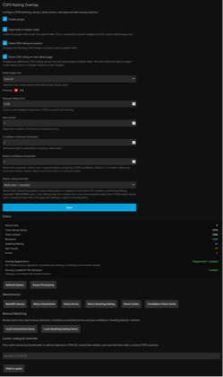

# Jellyfin ČSFD Rating Overlay plugin

Adds ČSFD ratings to Jellyfin movies and series. It fetches ratings from ČSFD, caches them locally, and displays them as overlays on your media cards and detail pages.

## Screenshots

[](docs/item-detail.png)

<table>
  <tr>
    <td align="center">
      <a href="docs/poster.png">
        
      </a>
    </td>
    <td align="center">
      <a href="docs/settings.png">
        
      </a>
    </td>
  </tr>
</table>

## Installation

1. Open your Jellyfin Dashboard.
2. Navigate to **Plugins** -> **Repositories**.
3. Add a new repository:
   - **Name:** ČSFD Rating Overlay
   - **Repository URL:** `https://github.com/007hacky007/jellyfin-csfd-rating/releases/latest/download/manifest.json`
4. Install **ČSFD Rating Overlay** plugin.
5. Install **File Transformation** plugin.
   - This plugin is required to automatically inject the overlay script.
   - See [jellyfin-plugin-file-transformation](https://github.com/IAmParadox27/jellyfin-plugin-file-transformation) for installation details.
6. Restart Jellyfin.
7. Profit!

## Troubleshooting: File Transformation plugin not working

If the overlay script is not being injected automatically, the File Transformation plugin may not have permission to modify the `index.html` file. This typically happens when the file is owned by `root` but Jellyfin runs as the `jellyfin` user.

You can verify this by checking the file ownership:

```bash
ls -la /usr/share/jellyfin/web/index.html
```

If it shows `root:root` and your Jellyfin runs under the `jellyfin` user, the File Transformation plugin cannot modify the file.

To fix this, create a systemd drop-in that restores ownership before Jellyfin starts:

```bash
sudo mkdir -p /etc/systemd/system/jellyfin.service.d
sudo tee /etc/systemd/system/jellyfin.service.d/fix-perms.conf <<EOF
[Service]
ExecStartPre=+/bin/chown jellyfin:jellyfin /usr/share/jellyfin/web/index.html
EOF
sudo systemctl daemon-reload
sudo systemctl restart jellyfin
```

The `+` prefix in `ExecStartPre` runs the command as root regardless of the service user, so it can change the file ownership before Jellyfin (and the File Transformation plugin) starts. This is needed because Jellyfin package updates may reset the file ownership back to `root`.

## Manual Overlay Injection

If you prefer not to use the **File Transformation** plugin, you can manually inject the overlay script into your Jellyfin web interface.

1. Locate your Jellyfin web `index.html` file (e.g., `/usr/share/jellyfin/web/index.html` on Linux).
2. Add the following line before the closing `</head>` tag:
   ```html
   <script src="/Plugins/CsfdRatingOverlay/web/overlay.js"></script>
   ```
3. Refresh your browser cache.
